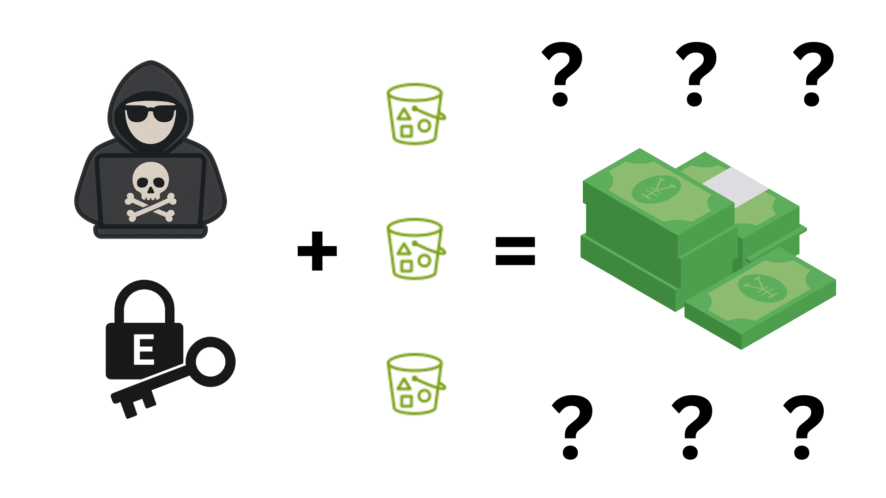

I am fascinated by the world of possibilities that Cloud Computing enables people and organizations to achieve. When it comes to security, tools and frameworks such as the Shared Responsibility Model make following good security practices easier than ever. I am equally fascinated by new attack vectors that Cloud Computing enables bad actors to achieve, though.

Not that recently ago, Halcyon put up a really [interesting article](https://www.halcyon.ai/blog/abusing-aws-native-services-ransomware-encrypting-s3-buckets-with-sse-c) about a concerning new ransomware campaign targeting Amazon S3 buckets. This is a new kind of ransomware. One that only exists in the cloud, thanks to the cloud, since it leverages some of the many great security features that are built-in into AWS to help organizations achieve security and compliance encrypting Amazon S3 Objects, but to encrypt for ransom instead.

I am not going to go over many details about the attack itself, since there are many great articles out there going over them already, like the one from Halcyon themselves or [this one](https://www.sentinelone.com/blog/cloud-ransomware-developments-the-risks-of-customer-managed-keys/) from SentinelOne. So why are we here, then? I believe the kind of information that these types of articles bring are priceless, but I also believe that one should be able to programmatically be able to validate if their own environment are susceptible to this kind of attack, and also validate if they can detect and respond in case they are.

This article is about understanding how S3 encryption works, how you can use the [S3 Ransomware Simulator](http://github.com/raphabot/s3-ransomware-simulator) to test your own environment, how you can programmatically detect this kind of attack, respond to it, but also how to prevent it as well. 

## The Attack

On its core, the attack is simple, but it requires understanding a bit of how encryption works in Amazon S3.

You might have heard that Amazon S3 automatically applies encryption to all new object uploaded at no additional cost and with no impact on  performance since January 5, 2023. And that's great news! But there are different ways to encrypt an object in AWS, so first we need to go over them.

### Understanding S3 Encryption

* [Client-side encryption](https://docs.aws.amazon.com/AmazonS3/latest/userguide/UsingClientSideEncryption.html) - This is the most straightforward type of Encryption in S3. You/your application encrypt the data, *before* uploading it to S3, with a key that you own and manage, even if outside of AWS.
* [Server-side encryption: Amazon S3 managed keys (SSE-S3)](https://docs.aws.amazon.com/AmazonS3/latest/userguide/UsingServerSideEncryption.html) - This Encryption method is the one that is enabled by default since 2023. You send your objects and they are encrypted by AWS Server-side, with Amazon S3 managed keys, and each object is encrypted with a unique key.
* [Server-side encryption: AWS KMS keys (SSE-KMS)](https://docs.aws.amazon.com/AmazonS3/latest/userguide/UsingKMSEncryption.html) - [AWS KMS](https://docs.aws.amazon.com/kms/latest/developerguide/overview.html) is a managed service to create and manage keys. Here you send your object and AWS uses server-side encryption leveraging these KMS keys to encrypt them, in case a compliance standard you must adhere to requires you to have full control of the encryption keys.
* [Dual-layer server-side encryption: AWS KMS keys (DSSE-KMS)](https://docs.aws.amazon.com/AmazonS3/latest/userguide/UsingDSSEncryption.html) - Not that different from SSE-KMS. However, some compliance standards require you to apply multilayer encryption to your data, so DSSE-KMS applies two layers of encryption to the objects.
* [Server-side encryption: customer-provided keys (SSE-C)](https://docs.aws.amazon.com/AmazonS3/latest/userguide/ServerSideEncryptionCustomerKeys.html#specifying-s3-c-encryption) - It's like Client-side and Server-Side encryptions had a baby. Like in Client-Side, AWS doesn't host/manage your keys. Like SSE, you don't need to worry about encrypting your objects before uploading to the bucket. Here you provide the key as part of the upload request and AWS will encrypt the object on upload, but never save the key anywhere. This is the one we care about.

### Why Is it Effective?

Given that an attacker has access to rewrite a victim's S3 Objects, picking SSE-C as encryption method is the most effective way to guarantee that only they can recover the objects. Since the attacker can create one unique key per victim, they can leverage this key to rewrite the objects, overwrite them and the only way to recover access to these files, would be using they key that belongs only to the attacker. 

## Replicating The Attack

In order to programmatically detect and respond to this kind of attack, we need to first be able to programmatically replicate this kind of attack. When it comes to the S3 API, I am fairly familiar with the [GetObject](https://docs.aws.amazon.com/AmazonS3/latest/API/API_GetObject.html) and [PutObject](https://docs.aws.amazon.com/AmazonS3/latest/API/API_PutObject.html) actions. But in my mind it wouldn't make much sense for an attacker to download (GetObject) every single object in a bucket in order to upload (PutObject) them  back, while encrypting the data. So I started a research on the best way to encrypt existing objects in a bucket.

That research led me to, funnily enough, AWS's own blog page, where a [blog post on how to encrypt existing objects](https://aws.amazon.com/blogs/storage/encrypting-existing-amazon-s3-objects-with-the-aws-cli/) described some of the best techniques. Even though the article uses the AWS CLI to encrypt the existing objects, and my goal is to use Python's [Boto3 SDK](https://boto3.amazonaws.com/v1/documentation/api/latest/index.html), it led me exactly to what I was looking for, the [CopyObject](https://docs.aws.amazon.com/AmazonS3/latest/API/API_CopyObject.html) action. In summary, I just need to make a [CopyObject](https://boto3.amazonaws.com/v1/documentation/api/latest/reference/services/s3/client/copy_object.html) request, where the source and destinations of the copy are the same object, while making sure I was making the proper encryption request as well.

### The Code

First and foremost, you can follow along in your own environment. You can find the code in the [S3 Ransomware Simulator GitHub repository.](http://github.com/raphabot/s3-ransomware-simulator). It tries, as much as possible, to mimic the behavior of an attacker exploiting your own AWS environment. 

The behavior goes as below:

1. It enumerate all the buckets available in that account, if the flag `--all-buckets` is used;
2. It generates and saves to disk an AES-256 encryption key to be used in the attack;
3. For each of the buckets, or just the one in case the flag `--bucket-name` was used it will:
    1. Check if it can PutObject in the bucket, dropping a dummy object
    2. Check if it can GetObject in the bucket, getting the previously uploaded dummy file
    3. Deletes the dummy file
    4. Considering all permissions are in place, and the flag  `--encrypt-objects` was provided, it will:
       1. List and encrypt all objects
       2. Drop a fake ransom note


An example of the execution can be seen below:

```bash
$ python3 attacker.py --bucket-name raphabot-no-ransomware --encrypt-objects

S3 Bucket Encryption Tool with SSE-C

Processing specified bucket: raphabot-no-ransomware
Generated AES-256 encryption key for SSE-C: M+a4reQycj3pBBZyYs1KE9XpOcdyT7kGq1Mu+q5u+vM=
Key MD5: S2k8nSe8W9C7A2JO+Nr4mw==

Checking bucket: raphabot-no-ransomware
  GetObject permission: Yes
  PutObject permission: Yes

Processing bucket: raphabot-no-ransomware
  Encrypting: regular-file.txt
  Encrypted 1 files in raphabot-no-ransomware using SSE-C
  Ransom note dropped in raphabot-no-ransomware.

Encryption key saved to encryption_key.bin
WARNING: This key is required to decrypt your files. Store it securely!

Encryption complete. Total files encrypted: 1
Warning: Without the encryption key, your files cannot be recovered!
```

## Detection:

In order to respond, we need first to detect. If you ever read about [logging and monitoring in Amazon S3](https://docs.aws.amazon.com/AmazonS3/latest/userguide/monitoring-overview.html), you know there are many different options to do so. To understand if our buckets are being targets of a Ransomware attack, however, some options are better than others.

So I created a criteria for how I'd listen to events. Whatever method that was picked, had to:

1. Be cheap/free
2. Be scalable
3. Be simple
4. Be fast on notifying of the event

If you've been around for a while, you might know that the most traditional way to listen to events in an S3 bucket is to use [Event Notification](https://docs.aws.amazon.com/AmazonS3/latest/userguide/EventNotifications.html). At first, this looked like a great option, since it is built to have event notifications delivered in seconds, it is [free](https://aws.amazon.com/blogs/storage/reliable-event-processing-with-amazon-s3-event-notifications/) and, although originally only supporting SNS and SQS, since November of 2021 [it supports EventBridge](https://aws.amazon.com/blogs/aws/new-use-amazon-s3-event-notifications-with-amazon-eventbridge/). If you are not familiar with [Amazon EventBridge](https://docs.aws.amazon.com/eventbridge/latest/userguide/eb-what-is.html), the gist is that it is a serverless service that makes it easier to build scalable event-driven applications.

Scalability doesn't end with the performance of detection, though, and I also want to be able to deploy this detection across many buckets at scale, as code. This is where this solution starts to fall apart. Despite CloudFormation obviously supporting S3 Buckets, the [S3::Bucket resource type](https://docs.aws.amazon.com/AWSCloudFormation/latest/UserGuide/aws-resource-s3-bucket.html) *creates* an Amazon S3 bucket, it doesn't update one. An alternative would be using [Custom Resources](https://docs.aws.amazon.com/AWSCloudFormation/latest/UserGuide/template-custom-resources.html), but this would come with its own set of challenges when it comes to scale (applying the event notification across multiple buckets before the [maximum Lambda timeout](https://docs.aws.amazon.com/lambda/latest/dg/configuration-timeout.html#:~:text=maximum%20value%20of-,900%20seconds%20(15%20minutes).,-This%20page%20describes), for instance), complexity (writing code to take in consideration any exceptions) and security (maintaining the code dependencies up to date). 

Another great option would be using [CloudTrail](https://docs.aws.amazon.com/awscloudtrail/latest/userguide/cloudtrail-user-guide.html). CloudTrail comes enabled by default, logs management events across AWS services also by default, and it is free. So, chances are that you are already using CloudTrail. It is fast, with AWS suggesting that CloudTrail publishes log files [about every 5 minutes](https://docs.aws.amazon.com/awscloudtrail/latest/userguide/how-cloudtrail-works.html#:~:text=about%20every%205%20minutes), but real world testing shows that the [delay is considerably lower than that](https://tracebit.com/blog/how-fast-is-cloudtrail-today-investigating-cloudtrail-delays-using-athena#:~:text=the%20average%20CloudTrail%20delay%20appears%20to%20be%20considerably%20lower%20%2D%20around%202%C2%BD%20minutes). It doesn't come without its own set of challenges, though.

Yes, CloudTrail is enabled by default and it's free... for management events. Events that happen within buckets, like CopyObjects, are called Data events, which are not enabled by default and they cost $0.10 per 100,000 data events delivered. However, when it comes to scalability and simplicity of deployment, it couldn't be a better match. Either through the Console or via CloudFormation, one can create a new CloudTrail Trail (you gotta love AWS naming!) to listen to one, some or all Buckets. As you can imagine, even if you filter to listen to data events of only the most critical S3 Buckets, listening to all data events can get pretty expensive pretty quickly. The good news is that CloudTrail enables us to use [advanced event selectors](https://docs.aws.amazon.com/awscloudtrail/latest/userguide/filtering-data-events.html) to filter which events we are listening to.

Creating an Advanced Selector like the one below, enables us to listen only to the CopyObject event for the selected Buckets:

```json
[
  {
    "Name": "CopyObject",
    "FieldSelectors": [
      {
        "Field": "eventCategory",
        "Equals": [
          "Data"
        ]
      },
      {
        "Field": "resources.type",
        "Equals": [
          "AWS::S3::Object"
        ]
      },
      {
        "Field": "eventName",
        "Equals": [
          "CopyObject"
        ]
      }
    ]
  }
]
```

In summary, using CloudTrail, we are able not just to deploy a "detector" at scale easily, but also to cheaply run it at scale as well. The proof is that you can find this Detection defined as CloudFormation code that you can apply today in the same [S3 Ramsomware Simulator repository](http://github.com/raphabot/s3-ransomware-simulator).

## Response:

Once we detect an attempt, we need to be able to respond to it. The response can and will look different based on different organization preferences. Some would not ever dream of making a change in their AWS environment automatically, others would like to have humans (like you!) notified so they can take action, but some would be fine to take at least some proactive action automatically based on these events, while further investigation is ongoing. For the purposes of this blog post, we will follow AWS' own [best practices on how to remediate if there are unauthorized activity in an AWS account](https://repost.aws/knowledge-center/potential-account-compromise).

The first step to remediate the compromise of an AWS identity is to, first, understand what kind of identity it is, since the remediation steps to deal with each kind of identity is different. The type of identity used in an API call [can be determined](https://docs.aws.amazon.com/awscloudtrail/latest/userguide/cloudtrail-event-reference-user-identity.html) by checking the `type` attribute of the `userIdentity` object in the CloudTrail event. There are three types of identity in AWS:

- **IAM User**: When one creates an IAM User and wants to make a request against an AWS service, they need to generate a long lived pair of access key id and secret. Shows up as `IAMUser` in CloudTrail.
- **Assumed Role**: This is generally used when an application/service, not a person, needs to access AWS resources. Assuming a role leads to AWS Security Token Service generating a short-lived pair. Shows up as `AssumedRole` in CloudTrail.
- **Identity Center User**: AWS IAM Identity Center streamlines and simplifies workforce user access to applications or AWS accounts. For a request made on behalf of an IAM Identity Center user, it will show up as `userIdentity` in CloudTrail.

Now let's talk about the actual remediation: blocking this identity from making further requests in the AWS account.

For an IAM User, for instance, you could disable the user's Access Keys. It's good to remember that AWS recommends that, as best practice, to use temporary security credentials (such as IAM roles) instead of creating long-term credentials like access keys. So that's probably a good idea anyway 😅 

For an Assumed Role, you have options. You could update the role to remove this access, you could attach a policy denying CopyObject actions to S3... the options are close to limitless! If you want to be precise, you can [restrict requests from the attacker's IP address](https://repost.aws/knowledge-center/iam-restrict-calls-ip-addresses).

### Example workflow that I setup for this Response:

The workflow below will guarantee that, in case of an attack where the identity is either an IAM User or an Assumed Role, that the identity will be invalidated automatically. 


You can find this sample Response defined as CloudFormation code in the same [S3 Ramsomware Simulator repository](http://github.com/raphabot/s3-ransomware-simulator).

<!-- - Adding AWSCompromisedKeyQuarantineV3: https://docs.aws.amazon.com/aws-managed-policy/latest/reference/AWSCompromisedKeyQuarantineV3.html
    - https://xebia.com/blog/what-happens-when-you-leak-aws-credentials-and-how-aws-minimizes-the-damage/ 
- Restrict requests from IP: https://repost.aws/knowledge-center/iam-restrict-calls-ip-addresses 


Issue with AWSCompromisedKeyQuarantineV3 - https://docs.aws.amazon.com/aws-managed-policy/latest/reference/AWSCompromisedKeyQuarantineV3.html
It lacks s3:PutObject - If I captured a list of objects already, I can still encrypt the files -->

## Prevention

Of course, better than remediating this kind of attack, is to prevent it in the first place. Perfect security is a pipe dream that we all chase, but there are some actions that you can take today to make your environment safer against this kind of threat. Here's a list of some of them.

### Restrict SSE-C Usage

The most effective action that you can take, in case your organization isn't using SSE-C, is to block its usage at least in the most critical S3 Buckets. Using Amazon S3 condition keys, you can update your Bucket Policy adding something like the following:

```json
{
    "Version": "2012-10-17",
    "Id": "PutObjectPolicy",
    "Statement": [
        {
            "Sid": "RestrictSSECObjectUploads",
            "Effect": "Deny",
            "Principal": "*",
            "Action": "s3:PutObject",
            "Resource": "arn:aws:s3:::my-important-bucket/*",
            "Condition": {
                "Null": {
                    "s3:x-amz-server-side-encryption-customer-algorithm": "false"
                }
            }
        }
    ]
}
```

### Restrict CopyObject

If your applications are not using the CopyObject action, it might be a good idea to block it in your most critical S3 Buckets. Example of BucketPolicy:

```json
{
    "Version": "2012-10-17",
    "Id": "CopyObjectPolicy",
    "Statement": [
        {
            "Sid": "RestrictCopyObject",
            "Effect": "Deny",
            "Principal": "*",
            "Action": "s3:CopyObject",
            "Resource": "arn:aws:s3:::my-important-bucket/*"
        }
    ]
}
```

### Object Versioning

This is by far the easiest to implement, with the best result. It is, as well, the most expensive. Enabling Object Versioning in your must critical buckets will guarantee that, in case of a Ransomware attack, or even an accidental overwrite or deletion, you can still recover the original Object. Example on how to enable it using the AWS CLI:

```bash
aws s3api put-bucket-versioning --bucket my-important-bucket --versioning-configuration Status=Enabled
```

Now, in case the identity that the attacker is assuming has full access to the objects in the bucket, they can still delete the older versions using s3:DeleteObjectVersion. You might want to deny this action as well:

```json
{
    "Version": "2012-10-17",
    "Id": "DeleteObjectVersionPolicy",
    "Statement": [
        {
            "Sid": "RestrictDeleteObjectVersion",
            "Effect": "Deny",
            "Principal": "*",
            "Action": "s3:DeleteObjectVersion",
            "Resource": "arn:aws:s3:::my-important-bucket/*"
        }
    ]
}
```

### Pretty please, avoid using hardcoded secrets

This one is self explanatory and a core principle of proper cloud and application security: avoid using hardcoded secrets. Sooner or later, one way or another, hardcoded secrets always find a way to get in the wrong hands. Secret Scanning should be part of your CI/CD pipelines.

## Conclusion

Although Ransomware is far from being a novel kind of attack, even in Cloud environments such as AWS, as the cloud usage ramps up, so does this kind of attack. As organizations move more and more of critical customer data to the cloud, while adoption techniques such as Workload Isolation to reduce blast radius, it's more important than ever to have a full grasp of the environment's posture.

Posture isn't enough, however. Different teams will have different levels of maturity and you must be ready to detect and respond to this kind of event in near real time. Make sure you are listening to, and reacting to, your CloudTrail events. A good way to understand if you organization is ready for this, but also to get ready as well, is using the provided code to simulate, detect and respond to this kind of attack in your own AWS accounts.