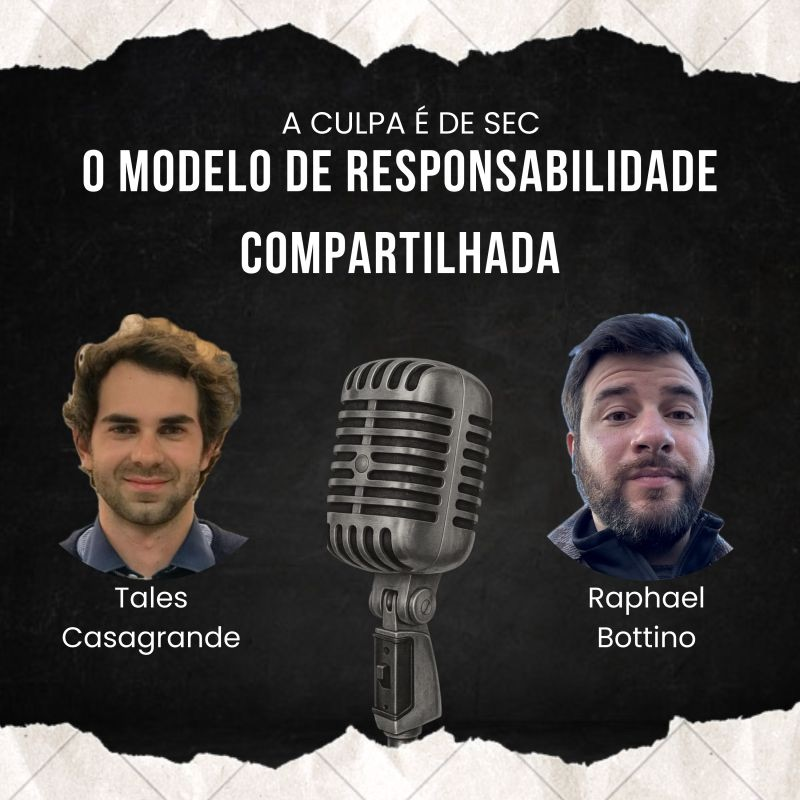

🍕Tudo acaba em pizza ou tudo começa em pizza? Azeite trufado ou ketchup na pizza? 

São muitas as perguntas, mas uma coisa é certa: Precisamos entender o Modelo de Responsabilidade Compartilhada. 

No episódio de hoje de A Culpa é de Sec, Tales Casagrande e eu discutimos o que é a tal da Responsabilidade Compartilhada, falamos de pizza e chegamos a conclusão de que pizza tem que ter sim ketchup, por mais que ele discorde :)

Dê o play, pede a sua pizza e vamos de a Culpa é de Sec!

Spotify: https://lnkd.in/grdCZzJd

Apple: https://lnkd.in/g6REQYQV

YouTube: https://lnkd.in/gJuhWJJ9